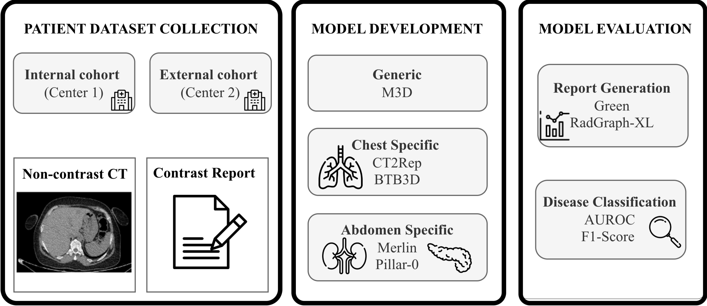

<div align="center">

# A Multi-Center Benchmark for Abdominal Disease Diagnosis and Report Generation from Non-Contrast CT

Mariam Elbakry<sup>1</sup>, Aliaa Sheha<sup>1</sup>, Salma Tantawy<sup>1</sup>, Aya Yassin<sup>1</sup>,
[Concetto Spampinato](https://www.dieei.unict.it/docenti/concetto.spampinato)<sup>3</sup>,
[Karim Lekadir](https://www.ub.edu/artificial-intelligence-in-medicine-lab/)<sup>4</sup>,
[Xiaomeng Li](https://xmengli.github.io/)<sup>2</sup>,
[Marawan Elbatel](https://marwankefah.github.io/)<sup>2</sup>

<sup>1</sup>Ain Shams University &nbsp;&nbsp; <sup>2</sup>HKUST &nbsp;&nbsp; <sup>3</sup>University of Catania &nbsp;&nbsp; <sup>4</sup>Universitat de Barcelona

[](https://conferences.miccai.org/2026/files/downloads/MICCAI2026-Main-Conference-Oral-and-Poster-Program.pdf)

[](https://arxiv.org/abs/2606.16991)
[](https://huggingface.co/datasets/marwankefah/TriALS-Report)
[](https://creativecommons.org/licenses/by-nc/4.0/)

</div>

This is the official implementation of **TriALS-Report**, a multi-center benchmark for abdominal disease diagnosis
and radiology report generation from non-contrast CT (NCCT).

**Related publications**

Benchmarking Foundation Models for Cervical Cancer CT Reporting in Zambia. Kangwa E. Mukuka, Lena Lambart,
Festus Mwape, Lighton Phiri, Concetto Spampinato, Karim Lekadir, Marawan Elbatel. *MICCAI 2026 Workshop AFRICAI*.
[OpenReview](https://openreview.net/forum?id=fpyn7ytdQj)

## Abstract

Multiphasic contrast-enhanced CT (CECT) is widely used for abdominal lesion characterization, yet it carries inherent
risks of contrast-induced nephropathy, escalates acquisition burden, and heavily contributes to radiologist workload.
To address these challenges, we introduce a novel multi-center benchmark for multi-organ abdominal disease diagnosis
and automated radiology report generation, which learns to synthesize contrast-enhanced findings from single-phase
non-contrast CT (NCCT). To support this, we curated a large-scale dataset of paired NCCT–CECT studies and their
corresponding contrast-enhanced radiology reports from two centers, partitioned into internal sets and an external
validation cohort. Under a unified evaluation protocol, we benchmarked five contemporary deep learning architectures
encompassing chest-specific, abdomen-specific, and general-purpose multimodal domains. Extensive experiments
demonstrate that NCCT retains diagnostic signals, achieving an average multi-organ AUC of 71.1% on the internal cohort
and 66.2% on the external cohort, respectively. By releasing this dataset and standardized benchmark publicly, this
study aims to catalyze future research into safer, resource-efficient, and globally accessible contrast-free
abdominal imaging workflows.

<p align="center">
  
</p>

*Study workflow. Non-contrast CT volumes are paired with the triphasic contrast-enhanced report of the same patient;
findings are extracted from the report to form the label space, and models are evaluated on disease diagnosis and
report generation.*


## Results

#### Carcinomas and metastases (internal and external test pooled, n=388)

🔥 **Zero-shot [DAMO RADAR](https://github.com/alibaba-damo-academy/damo-radar) outperforms linear probes on Pillar-0 and Merlin for carcinoma and liver metastasis detection on TriALS-Report, without any training on this data.**

| Model | Hepatocellular carcinoma | Pancreatic tumor | Colonic carcinoma| Hepatic metastases                |  Metastatic disease (n=92) |
|---|---|---|---|-----------------------------------|---|
| Pillar-0 | 83.23 <sub>[76.1, 89.3]</sub> | 82.46 <sub>[69.7, 92.8]</sub> | 56.51 <sub>[41.4, 70.9]</sub> | 75.62 <sub>[68.4, 82.5]</sub>     | 71.06 <sub>[64.9, 76.4]</sub> |
| Merlin | 81.74 <sub>[73.1, 88.9]</sub> | 66.10 <sub>[49.1, 83.4]</sub> | 49.26 <sub>[34.0, 63.4]</sub> | 69.72 <sub>[61.2, 77.3]</sub>     | **71.63** <sub>[65.1, 77.8]</sub> |
| DAMO RADAR (zero-shot) | **92.42** <sub>[88.3, 95.7]</sub> | **91.26** <sub>[78.2, 98.8]</sub> | **67.61** <sub>[54.8, 80.5]</sub> | **87.12** <sub>[82.3, 91.1]</sub> | 68.56 <sub>[62.5, 74.2]</sub> |

#### Organ-level results (paper)

Non-contrast CT, frozen encoder + linear probe. AUC in %, 95% bootstrap CI in brackets.

#### Internal test (Center 1, n=219)

| Model | Liver (10 diseases) | Pancreas (3 diseases) | Average (15 organs, 51 diseases) |
|---|---|---|---|
| Pillar-0 | 68.24 <sub>[65.2, 71.5]</sub> | **80.39** <sub>[71.4, 87.9]</sub> | 69.92 <sub>[67.4, 72.2]</sub> |
| Merlin | **69.48** <sub>[66.5, 72.4]</sub> | 76.00 <sub>[65.1, 85.6]</sub> | **71.05** <sub>[68.8, 73.3]</sub> |

#### External test (Center 2, n=169)

| Model | Liver (10 diseases) | Pancreas (3 diseases) | Average (15 organs, 51 diseases) |
|---|---|---|---|
| Pillar-0 | 66.48 <sub>[62.4, 70.8]</sub> | **78.55** <sub>[64.8, 92.1]</sub> | 65.71 <sub>[63.2, 68.4]</sub> |
| Merlin | **68.15** <sub>[64.3, 72.1]</sub> | 61.32 <sub>[52.5, 70.1]</sub> | **66.24** <sub>[63.7, 68.8]</sub> |

Liver: cirrhosis, congenital liver cysts, hepatic changes post-resection, hepatic cysts, hepatic hemangiomas,
hepatic masses, hepatic metastases, hepatic steatosis, hepatocellular carcinoma, hepatomegaly.
Pancreas: main pancreatic duct dilatation, pancreatic atrophy, pancreatic tumors.

The taxonomy has 53 diseases over 16 organs; the average covers the 15 organs excluding Multi-organ (metastatic
disease, inguinal hernias), so 51 diseases. Chance level is 50.00 AUC. F1 and all 16 organs are written to
`results/summary_organs.csv` and `results/<model>/<split>/seed<k>/`.

The encoders, [Pillar-0](https://huggingface.co/YalaLab/Pillar0-AbdomenCT) and
[Merlin](https://huggingface.co/stanfordmimi/Merlin), are frozen and only the probe is trained, so no checkpoints are
released.


## Dataset

Each case is a non-contrast CT volume paired with the triphasic radiology report, from which 232 findings were
extracted. Volumes are 512 x 512, mean in-plane spacing 0.875 x 0.875 mm, mean slice thickness 1.07 mm.

| Split | Center 1 (internal) | Center 2 (external) | Total |
|---|---|---|---|
| Train | 760 | – | 760 |
| Val | 106 | – | 106 |
| Test | 219 | 169 | 388 |
| **Patients / Volumes** | **1,085** | **169** | **1,254** |

```sh
huggingface-cli download marwankefah/TriALS-Report --repo-type dataset --local-dir ./TriALS-Report
```

```text
TriALS-Report/
├── label_dictionary.csv          column, organ, question
├── Center 1/
│   ├── labels.csv                patient_id, center, split, image, 232 finding columns
│   └── ct/<patient_id>.nii.gz
└── Center 2/
    ├── labels.csv
    └── ct/<patient_id>.nii.gz
```

See the [dataset card](https://huggingface.co/datasets/marwankefah/TriALS-Report) for the label and split conventions.

## Installation

```sh
git clone https://github.com/xmed-lab/TriALS-Report
cd TriALS-Report
conda create -n trials-report python=3.11 -y
conda activate trials-report
pip install -r requirements.txt
```

## Disease diagnosis

### 1. Extract features

Everything below is built from the downloaded dataset. Preprocessing uses
[rad-vision-engine](https://github.com/yalalab/rave) and extraction uses
[RATE-Evals](https://github.com/marwankefah/rate-evals); the four lists are `center1_train`, `center1_val`,
`center1_test` and `center2_test`.

```sh
# list the volumes per center and split
python prepare.py series --data ./TriALS-Report --work ./work

# preprocess each list
for L in center1_train center1_val center1_test center2_test; do
  vision-engine process --config rad-vision-engine/configs/ct_abdomen.yaml \
      --input-series-csv work/series/$L.csv --output work/cache/$L --workers 16
done

# inputs for rate-extract
python prepare.py rate-inputs --data ./TriALS-Report --work ./work

# embeddings, per list (Merlin: --model merlin --model-repo-id stanfordmimi/Merlin)
for L in center1_train center1_val center1_test center2_test; do
  rate-extract --model pillar0 --dataset abd_ct_merlin --split train --batch-size 1 \
      --model-repo-id YalaLab/Pillar0-AbdomenCT --output-dir work/emb/pillar0/$L \
      data.train_json=work/rate/$L.jsonl data.cache_manifest=work/rate/manifest_$L.csv
done

# collect them next to the labels
python prepare.py features --data ./TriALS-Report --work ./work --model pillar0
```

This writes `TriALS-Report/features/pillar0/{center1,center2}.parquet`, which `run_benchmark.py` reads.

### 2. Run the probe

```sh
python run_benchmark.py --data ./TriALS-Report --out results
```

The probe trains on Center 1 train, picks the epoch by mean AUC on Center 1 val, and is evaluated on Center 1 test
(internal) and Center 2 (external). Patient counts are printed and test patients of the same center are checked
against train.

```text
results/<model>/<internal|external>/seed<k>/
    predictions.csv          accession, question, probability, prediction, true_label
    bootstrap.json           per-organ and average AUC/F1 with 95% CIs
    threshold_per_question.csv, threshold_overall.csv
results/summary.csv          average AUC/F1 per model, mean and SD over seeds
```

Options: `--models pillar0`, `--seeds 0 1 2`, `--n-boot 200`, `--device cuda`, `--no-val` (keep the last epoch, as
in the paper).

One `nn.Linear(D, 232)` is trained on all findings jointly, `BCEWithLogitsLoss` with `pos_weight` =
negatives/positives per finding, Adam (lr 1e-3), up to 1000 epochs, batch 8192, threshold 0.5. Organ-level AUC/F1
average the per-disease scores within each organ, over 1,000 patient-level bootstrap resamples. The paper's runs
trained a fixed 1000 epochs without validation and were unseeded; this code seeds the probe and selects the epoch on
val, so values can differ slightly.

### 3. Zero-shot DAMO RADAR

Set up [DAMO RADAR](https://github.com/alibaba-damo-academy/damo-radar) and download its checkpoints:

```sh
git clone https://github.com/alibaba-damo-academy/damo-radar
cd damo-radar
conda create -n radar python=3.10 -y && conda activate radar
pip install -r requirements.txt
git apply ../patches/radar_inference_memory.patch   # lower GPU memory on full-size scans, same outputs
cd download_scripts && python download_checkpoints.py && cd ../..
```

Run it on the 388 test volumes (a GPU is required), then score the output:

```sh
python prepare.py radar-inputs --data ./TriALS-Report --work ./work

cd damo-radar/RADAR_inference
python inference_demo.py --img_dir ../../work/radar_inputs --save_dir ../results --save_tag trials_report_test
cd ../..

python score_radar.py --data ./TriALS-Report \
    --radar damo-radar/results/RADAR_infer_results_trials_report_test.csv
```

`radar-inputs` links the test volumes as `Center1__<id>.nii.gz` and `Center2__<id>.nii.gz`, the names RADAR writes
to its output, and `score_radar.py` prints the table above.

## Acknowledgment

Built on [RATE-Evals](https://github.com/marwankefah/rate-evals) and
[rad-vision-engine](https://github.com/yalalab/rave). The evaluated encoders are
[Pillar-0](https://huggingface.co/YalaLab/Pillar0-AbdomenCT) and [Merlin](https://huggingface.co/stanfordmimi/Merlin), and the zero-shot comparison uses
[DAMO RADAR](https://github.com/alibaba-damo-academy/damo-radar).

## License

Released under [CC BY-NC 4.0](https://creativecommons.org/licenses/by-nc/4.0/). The frozen encoders keep their
original licenses.

## Citation

````
@misc{elbakry2026multicenterbenchmarkabdominaldisease,
      title={A Multi-Center Benchmark for Abdominal Disease Diagnosis and Report Generation from Non-Contrast CT}, 
      author={Mariam Elbakry and Aliaa Sayed Sheha and Salma Hassan Tantawy and Aya Yassin and Concetto Spampinato and Karim Lekadir and Xiaomeng Li and Marawan Elbatel},
      year={2026},
      eprint={2606.16991},
      archivePrefix={arXiv},
      primaryClass={cs.CV},
      url={https://arxiv.org/abs/2606.16991}, 
}
````

If you use the features or the evaluation protocol, please also cite RATE-Evals / Pillar-0, Merlin and
rad-vision-engine.
